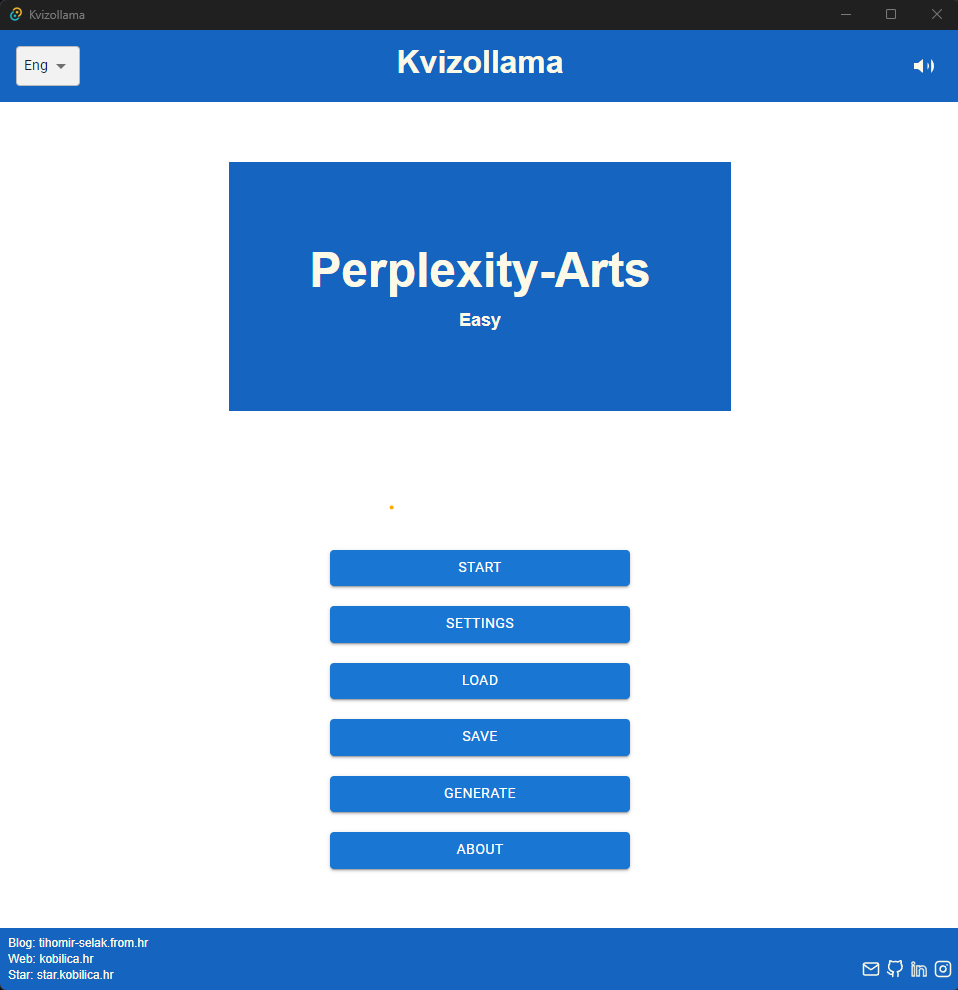

## Ollama Quiz Readme: The Ultimate Quiz Generator

Welcome to the world of interactive education with Ollama Quiz! This guide will take you through every step from installing and setting up your environment, creating quizzes tailored to various topics, configuring difficulty levels, and tracking user performance.

<div align="center">
   
</div>

### Prerequisites:

2. **Install Ollama**: Start by installing the main application of Ollama at https://ollama.com/

3. **Add Qwen2 mode**: SOnce installed, launch Ollama run the command "ollama run qwen2" in your terminal or command prompt. This command installs the Qwen2 model on your local machine, which is crucial for generating quizzes based on specified topics.

### Key Features:

🚀 **Customizable Quizzes**: Set up quizzes tailored to specific needs, with the ability to adjust number of questions, topic areas, and difficulty levels.

📜 **Interactive Interface**: Enjoy an intuitive design that guides you through creating, managing, and playing quizzes without hassle.

🌟 **Compatibility**: Seamless integration with popular email services for distributing your quizzes.

### How to Use Ollama Quiz:

1. **Setup Your Quiz**: Choose a quiz topic, set the number of questions per topic, and define the difficulty level based on your target audience's familiarity with the subject.
2. **Question Management**: Import or export lists of questions using various formats for organization and sharing.
3. **Difficulty Filtering**: Easily sort questions by difficulty to create quizzes that match your users' skill levels.

### Start

```bash
cargo run ./main.rs
```

### Start

```bash
yarn start
```

## Isntall Rust

./scripts/rustup-init.exe -y
./scripts/update_version.bat

### Rust Update

```bash
cd ./src-tauri
cargo update
```

#### Default export

```bash
tauri build
```
